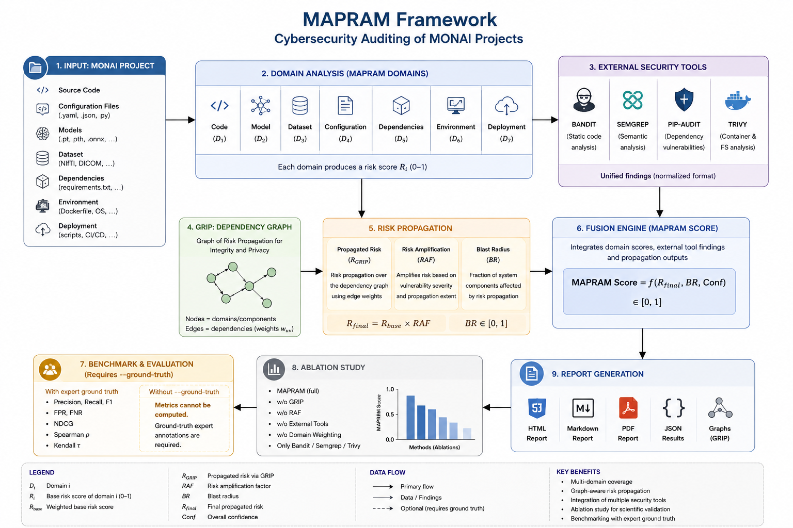
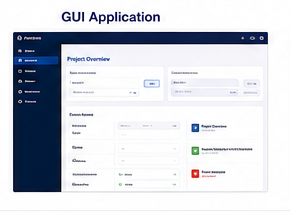
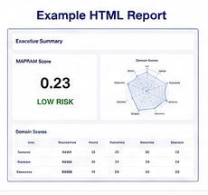

# MONAI Security Auditor

> **Graph-aware cybersecurity auditing framework for MONAI-based medical AI projects**


MONAI Security Auditor is an open-source research toolkit for cybersecurity, integrity, reproducibility, and risk analysis of **MONAI-based medical AI projects**.

It combines project-aware auditing, MONAI-specific checks, graph-aware risk propagation, optional external security scanners, and reproducible report generation. The project is designed for research workflows and for technical assessment before deployment, but it does **not** replace clinical validation, regulatory review, or institutional security assessment.

---

## Overview

<p align="center">
  
</p>

```text
MONAI Project
    |
    v
Domain Analysis
    |
    +--> Code
    +--> Model
    +--> Dataset
    +--> Configuration
    +--> Dependencies
    +--> Environment
    +--> Deployment
    |
    v
GRIP Dependency Graph
    |
    v
Risk Propagation
    |
    +--> R_GRIP
    +--> RAF
    +--> Blast Radius
    |
    v
MAPRAM Fusion
    |
    v
Reports and Experimental Evaluation
```

---

## Key Features

| Capability | Status |
|---|:---:|
| Dependency auditing | Yes |
| Model artifact inspection | Yes |
| NIfTI dataset metadata inspection | Yes |
| MONAI transform review | Yes |
| MONAI Bundle-like structure review | Yes |
| SHA-256 integrity checks | Yes |
| MAPRAM domain scoring | Yes |
| GRIP dependency graph | Yes |
| Risk propagation analysis | Yes |
| RAF and Blast Radius | Yes |
| External scanner integration | Optional |
| Bandit integration | Optional |
| Semgrep integration | Optional |
| pip-audit integration | Optional |
| Trivy integration | Optional |
| Ablation study support | Yes |
| Expert ground-truth evaluation | Optional |
| HTML report | Yes |
| Markdown report | Yes |
| JSON results | Yes |
| PDF report | Yes |
| Desktop GUI | Yes |

---

## Scientific Concept

MONAI Security Auditor extends conventional static security auditing with a multi-domain and graph-aware assessment model.

The experimental framework currently includes:

- **MAPRAM domains** for structured project-level risk decomposition,
- **domain weighting** for relative importance of security areas,
- **GRIP** for dependency-aware propagation of risk,
- **R_GRIP** for propagated risk,
- **RAF** for risk amplification,
- **Blast Radius** for propagation extent,
- **fusion of internal and external scanner findings**,
- **ablation variants** for experimental comparison,
- **benchmark evaluation** when expert reference annotations are available.

### Important methodological note

Classification and ranking metrics must not be interpreted as valid without an independent expert reference standard.

The following metrics require a ground-truth file passed using:

```bash
--ground-truth expert_annotations.csv
```

Metrics that require expert reference data include:

- Precision
- Recall
- F1-score
- False Positive Rate (FPR)
- False Negative Rate (FNR)
- NDCG
- Spearman correlation
- Kendall tau

If no expert reference file is provided, these metrics should be reported as **not computed**, not estimated.

---

## Quick Start

### 1. Clone the repository

```bash
git clone https://github.com/karkoz12/monai-security-auditor.git
cd monai-security-auditor
```

### 2. Create an environment

```bash
conda create -n monai_security python=3.11 -y
conda activate monai_security
```

### 3. Install dependencies

```bash
pip install -r requirements.txt
```

For PDF reports:

```bash
pip install reportlab
```

---

## CLI Usage

### Basic project audit

```bash
python monai_security.py security .
```

### Project + dataset

```bash
python monai_security.py security . --dataset data
```

### Project + dataset + model directory

```bash
python monai_security.py security . --dataset data --model models --out monai_security_report
```

### MAPRAM experimental mode

```bash
python monai_security_mapram.py security . --dataset data --model models --out experiment_results
```

### External security tools

```bash
python monai_security_mapram.py security . --dataset data --model models --external-tools --out experiment_results
```

### Expert ground truth

```bash
python monai_security_mapram.py security . --external-tools --ground-truth expert_annotations.csv --out benchmark_results
```

---

## GUI

Launch the graphical interface:

```bash
python monai_security_gui.py
```

The GUI supports:

- project selection,
- dataset selection,
- model selection,
- output directory selection,
- automatic dataset/model detection,
- audit execution,
- console log display,
- direct access to HTML, Markdown, and PDF reports.

<p align="center">
  
</p>

---

## Example Report

<p align="center">
  
</p>

Typical report outputs include:

```text
monai_security_report/
|
+-- monai_security_report.html
+-- monai_security_report.md
+-- monai_security_report.json
+-- monai_security_report.pdf
+-- summary.txt
+-- dependencies.json
+-- model_files.json
+-- dataset_metadata.json
+-- monai_transforms.json
```

MAPRAM experiments may additionally generate:

```text
mapram_results.json
grip_graph.json
unified_findings.json
external_tool_runs.json
benchmark_metrics.json
```

---

## External Security Tools

| Tool | Purpose |
|---|---|
| Bandit | Python static security analysis |
| Semgrep | Rule-based and semantic static analysis |
| pip-audit | Python dependency vulnerability analysis |
| Trivy | Dependency, filesystem, and container analysis |

External scanner findings should be normalized to a common representation before fusion with MAPRAM results.

---

## Repository Structure

Current repository layout:

```text
monai-security-auditor/
|
+-- README.md
+-- LICENSE
+-- generate_monai_security_docs.py
+-- monai_dataset_security.py
+-- monai_security.py
+-- monai_security_gui.py
|
+-- assets/
+-- MONAI_Security_Documentation/
+-- monai_demo_projects/
+-- monai_demo_projects_clean/
+-- monai_security_report/
```

---

## Documentation

Project documentation is currently stored in:

```text
MONAI_Security_Documentation/
```

Recommended pages:

- Installation
- Quick Start
- CLI reference
- GUI usage
- MAPRAM methodology
- GRIP methodology
- External scanner protocol
- Benchmark protocol
- Ablation studies
- Reproducibility
- Limitations
- Citation

### MkDocs

```bash
pip install mkdocs mkdocs-material
mkdocs serve
```

For GitHub Pages:

```bash
mkdocs gh-deploy
```

---

## Example Projects

The repository should contain two minimal demonstrator projects.

### PASS example

```text
monai_demo_projects_clean/
```

Purpose:

- demonstrate a clean MONAI project structure,
- show expected scanner behavior,
- provide a reproducible example for tutorials and CI tests.

### FAIL example

```text
monai_demo_projects/
```

Purpose:

- demonstrate intentionally problematic configurations,
- generate known findings,
- support regression testing,
- make scanner behavior understandable for new users.

These examples should contain only synthetic or public non-sensitive test data.

---

## Assets

All README and documentation graphics should be stored in:

```text
assets/
```

Recommended files:

```text
assets/logo.png
assets/mapram_framework.png
assets/gui.png
assets/report_example.png
```

---

## Citation

The repository should include a `CITATION.cff` file.

GitHub can then display a **Cite this repository** button automatically.

Example citation:

```text
Kozak, K. MONAI Security Auditor:
Cybersecurity auditing framework for MONAI-based medical AI projects.
Version 0.1.0.
```

Example BibTeX:

```bibtex
@software{kozak_monai_security_auditor_2026,
  author  = {Kozak, Karol},
  title   = {MONAI Security Auditor},
  year    = {2026},
  version = {0.1.0},
  url     = {https://github.com/karkoz12/monai-security-auditor}
}
```

Once a Zenodo DOI is created, add the DOI here and update the badge at the top of the README.

---

## Continuous Integration

The repository should use GitHub Actions.

Recommended workflows:

### `tests.yml`

Run automatically on:

```text
push
pull_request
```

Suggested jobs:

- install Python,
- install project dependencies,
- run unit tests,
- run CLI smoke test,
- verify report generation,
- optionally test multiple Python versions.

### `build-reports.yml`

Suggested purpose:

- run the PASS example,
- run the FAIL example,
- generate representative reports,
- upload reports as GitHub Actions artifacts.

This makes the repository reproducible and provides evidence that the software is continuously tested.

---

## Release Strategy

The first public release should be:

```text
v0.1.0
```

Suggested release title:

> **MONAI Security Auditor v0.1.0 — Research Preview**

Recommended release artifacts:

```text
Source code
README
example reports
sample configuration
CHANGELOG
documentation snapshot
```

Suggested release notes:

```text
Initial research preview of MONAI Security Auditor.

Highlights:
- MONAI project auditing
- model and dataset integrity checks
- MONAI transform review
- MONAI Bundle-oriented checks
- MAPRAM risk assessment
- GRIP dependency graph
- optional external scanner integration
- HTML, Markdown, JSON and PDF reporting
- desktop GUI
```

---

## Roadmap

### v0.1.x

- improve documentation,
- stabilize report format,
- add tests,
- improve GUI robustness.

### v0.2

- richer MONAI Bundle validation,
- SBOM generation,
- improved dependency provenance,
- stronger external scanner normalization.

### v0.3

- DICOM-focused security checks,
- container and deployment analysis,
- improved CI/CD integration.

### v1.0

- stable API,
- stable rule identifiers,
- validated benchmark protocol,
- publication-linked release.

---

## For Researchers

MONAI Security Auditor can support research involving:

- medical AI cybersecurity,
- software supply-chain risk,
- reproducibility,
- model provenance,
- graph-based risk analysis,
- medical imaging pipelines,
- MONAI deployment workflows.

Researchers are encouraged to preserve:

- the exact software version,
- configuration,
- domain weights,
- external tool versions,
- ground-truth annotations,
- generated JSON results.

---

## For Clinical and Technical Teams

The tool can help identify technical risks before deployment, but it should be treated as a supporting audit instrument.

It does not provide:

- clinical performance validation,
- medical device certification,
- regulatory approval,
- penetration testing,
- institutional risk acceptance.

Findings should be reviewed by qualified technical and clinical stakeholders.

---

## Security

Please do not report potentially exploitable vulnerabilities in public GitHub issues.

Use the process described in:

```text
SECURITY.md
```

---

## Contributing

Contributions are welcome.

Good contribution areas include:

- new MONAI-specific security rules,
- additional example projects,
- scanner normalization,
- report improvements,
- tests,
- documentation,
- reproducibility tooling.

See:

```text
CONTRIBUTING.md
```

---

## License

Recommended license:

**Apache License 2.0**

See:

```text
LICENSE
```

---

## Project Status

**Research Preview**

The project is under active development. APIs, scores, risk weights, and experimental definitions may change before v1.0.

---

## Acknowledgements

MONAI Security Auditor is designed for the MONAI ecosystem and medical AI research workflows.

**This is an independent open-source research project. It is not an official Project MONAI component and is not endorsed by Project MONAI.**
